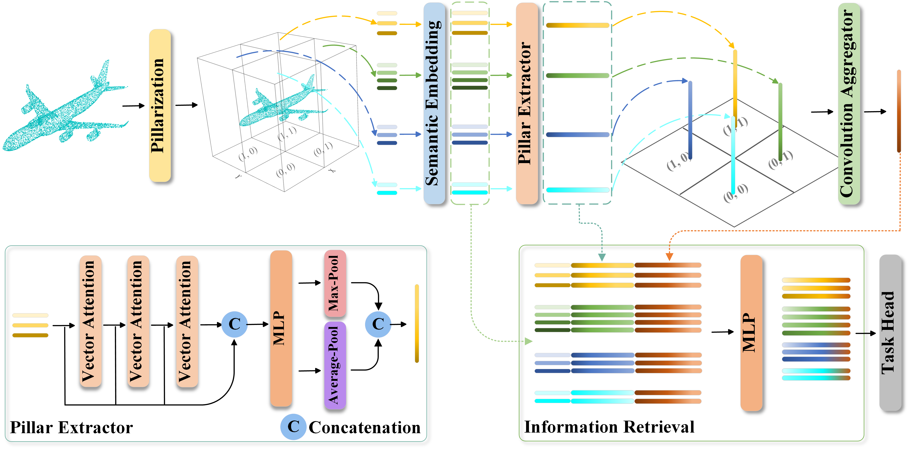

## PillarCoder: An Efficient Lightweight Attention Network with Pillarization for Point Cloud Learning

### Abstract

----------------------------

> Existing point cloud learning networks based on the attention mechanism have achieved stunning results, but they also suffer from high computational and storage resources as the generation of attention maps and their usage require computation with respect to all points. To address this problem, we explore PillarCoder, an efficient lightweight point cloud learning network, which transforms the generation and usage of attention maps from requiring computation on all points to a finite number of pillars through the pillarization. Specifically, 3D space is first grouped into non-overlapping equal-volume vertical pillars, and the pillar extractor constructed from the vector self-attention layer is applied to extract shape features inscribed by points within each vertical pillar. In addition, we design both semantic embedding and contextual position encoding to enhance the capability of the pillar extractor in terms of semantic capture and positional information retention, respectively. Second, the convolution aggregator is proposed based on the residual Depth-wise blocks formed by the Depth-wise and Point-wise convolutions to aggregate the global feature of a point cloud from the dense pillar-level features with fewer resource requirements. Then, the information retrieval module is used to match each point feature with its corresponding pillar feature and global feature, making each point contain both local and global spatial information. Experimental results on point cloud recognition and segmentation show that PillarCoder is able to maintain competitive results with faster inference and lower requirements on computational and storage resources compared to existing attention networks.

### Pipeline 

---------------------------------------------

### Contributions

--------------------------------------------

> - We design an efficient lightweight point cloud learning network PillarCoder, achieving faster inference and lower computational and storage resource requirements by transforming the generation and usage of attention maps from requiring computation on all points to a finite number of pillars, while maintaining competitive results.
> - The pillar extractor is constructed based on the vector self-attention, and the semantic embedding and contextual positional encoding are designed to enhance the ability of the pillar extractor to extract local geometry in terms of semantic capture and fine positional information retention, respectively.
> - To efficiently aggregate the global feature of a point cloud from the pillar features, we propose the residual Depth-wise block based on the Depth-wise and Point-wise convolutions, and construct the convolution aggregator by stacking the well-designed residual Depth-wise blocks.

### Results

----------------------------

|     ModleNet40 |        |    ShapeNet    |        | S3DIS  |
|:---------------:|:------:|:--------------:|:------:|:------:|
|      OA(%)      |  93.6  |   Ins. mIoU    |  86.9  |  69.5  |
|     mAcc(%)     |  91.2  |  Cat. mIoU     | 84.3   |  89.3  |
|  Inference(ms)  | 38.621 | Inferences(ms) | 32.378 | 97.116 |
|    Params(M)    | 0.872  |   Params(M)    | 0.723 | 1.366  |
|    FLOPs(G)     | 0.618  |    FLOPs(G)    | 1.526 | 8.504  |

